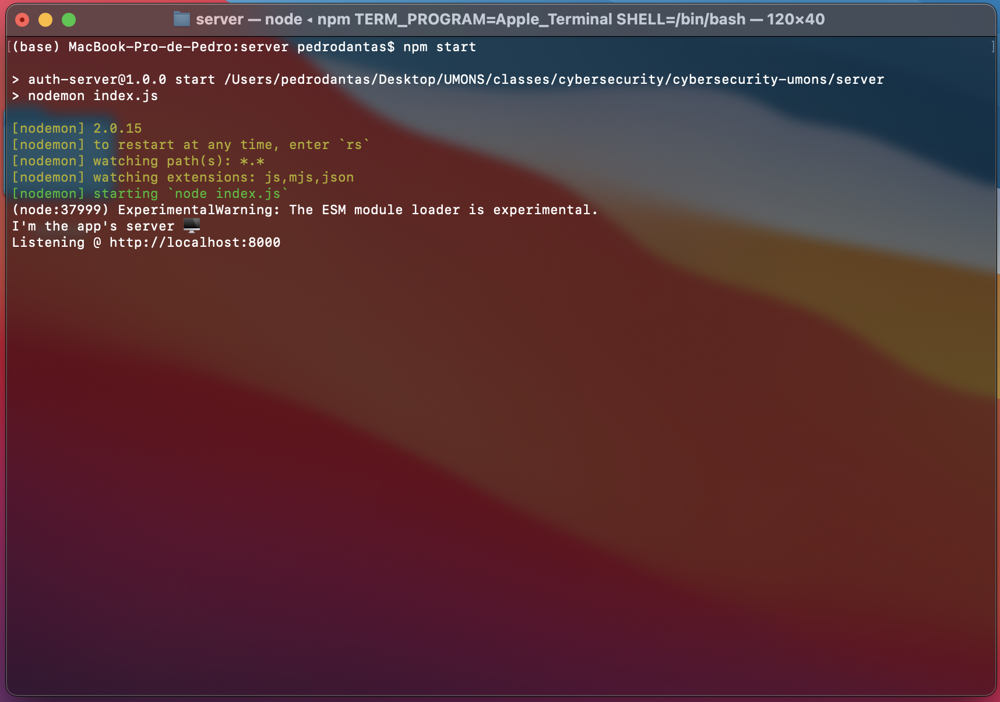
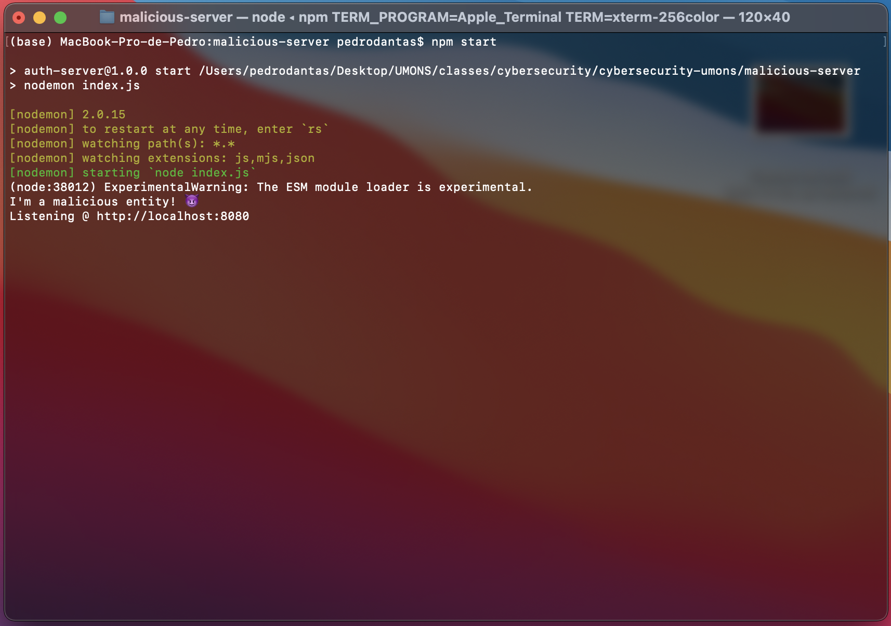
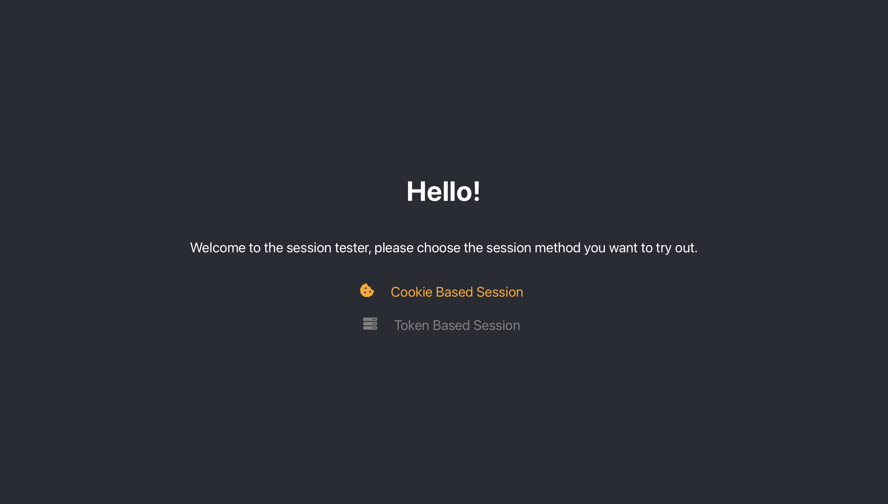
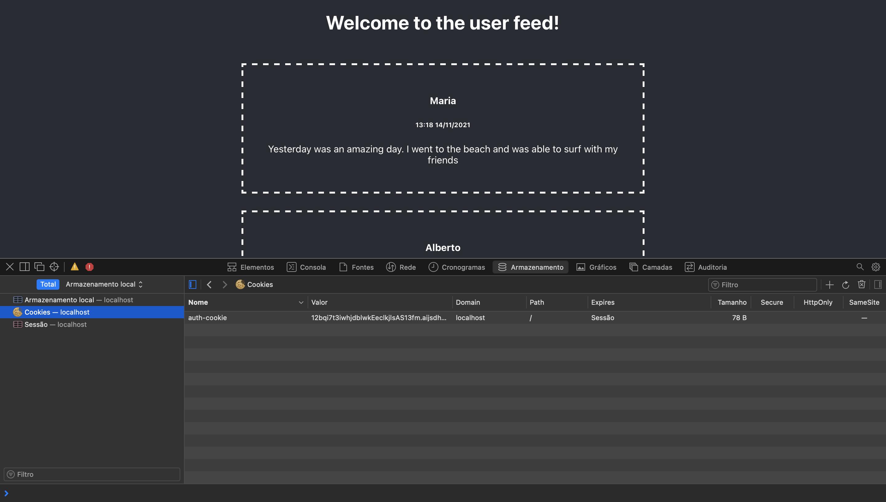

# CyberSecurity - UMONS

This project is a result of the CyberSecurity & IT Management course from the Université de Mons. We decided to tackle Web Authentication and Session Management. This project allows you to inspect how both cookie based session and token based sessions work. We were not worried about some basic code guidelines like using cryptography for passwords or implementing JWT and user info for cookie use, we just wanted to understand the main differences between saving sessions on Cookies or on LocalStorage. If you access the malicious link on the __user-feed__ page you can understand how these different storage systems work on HTTP requests.

The project consists of 3 different processes. The __App__, the __Server__, and the __Malicious Entity__. You need to start these three processes first and then start using the __App__ as a regular user (the username credentials don't matter, as long as you type _pass123_ on the password field). You have two authentication systems, one using cookies and another one using the local storage. You can navigate the user feed until you reach the malicious link. Depending on the session system you chose you can see on the __Malicious Entity's__ responses on the terminal wether or not you were hacked.






## Run it

* Install node.

* Open three terminal windows. One for the __App__, one for the __Server__ and one for the __Malicious Entity__

* On the __1st__ terminal:
   1. ```cd client/```
   2. ```npm install```
   3. ```npm start```
* On the __2nd__ terminal:
   1. ```cd server/```
   2. ```npm install```
   3. ```npm start``` 
* On the __3rd__ terminal:
   1. ```cd malicious-server/```
   2. ```npm install```
   3. ```npm start``` 
